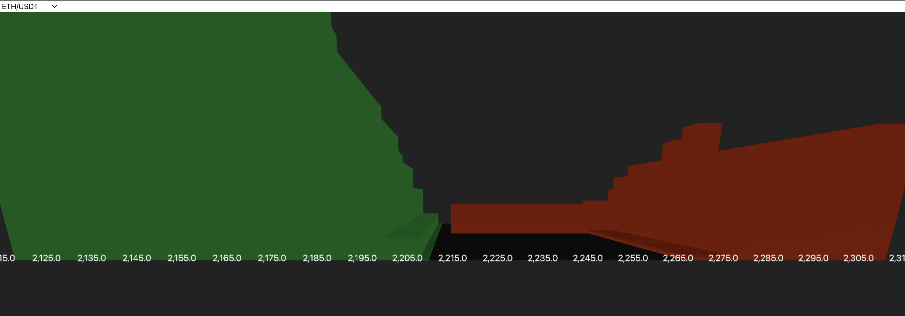

# Visualization of Kraken Crypto Exchange Orderbooks in 3 Dimensions

This repository holds all the necessary components to visualize an orderbook from Kraken Crypto Exchange in 3 dimensions. Historically, L2 Orderbooks have been used to display the bid ask spread as a function of price and time. Here we have developed our own orderbook to hold Kraken Data, Feedhandlers to pull from the public API, and a React App using the three.js library to visualize an order book for any currency in the Kraken Exchange as a function of price, time and a third component, depth. 

### Components:
- Backend
    - Typescript
    - KrakenAPI
    - Websocket
- Frontend
    - HTML/CSS
    - React
    - three.js

## Goal
Our goal is to develop a 3D visualization of an order book to display financial instruments of an exchange with price, quantity, and depth. 

## Description
This is a semester long project for IE 421 - High Frequency Trading Technology instructed by Professor David Lariviere.

## Teammates

**Kenny Kim (kk67@illinois.edu)**
- Hello my name is Kenny Kim a Junior in Computer Engineering and Math at the University of Illinois at Urbana-Champaign interested in Computer Vision and Quantitative Finance. I have worked in the industry as a Software Development Engineering Intern at Amazon with AWS Simspace Weaver where I did full-stack development and have taken Computational Photography, Machine Learning, Computer Systems, etc here at UIUC. Outside of work, I like to play music and rock climb. 

- My LinkedIn is located here: https://www.linkedin.com/in/kennydkim/

**Ritul K. Soni (ritulsonicareer@gmail.com)**
- Hello my name is Ritul K. Soni and I am a Chicago Based Software Developer currently a Junior studying Computer Science & Economics at The University of Illinois Urbana Champaign. Driven by a profound passion for software development in the realm of quantitative finance, I am eager to leverage my educational background in Economics and Computer Science to excel in this field. Additionally, my interests extend to the domains of AI, machine learning, and data visualization, fueling my enthusiasm to explore and contribute to these cutting-edge areas.


- My Website is located here: https://ritulsoni.com/
- My LinkedIn is located here: https://www.linkedin.com/in/RitulSoni/


**Joe Morrissey (jrm15@illinois.edu)**
- Hi, I am Joe Morrissey, a Junior Computer Science at the University of Illinois Urbana-Champaign. I have taken classes related to Computational Photography, Deep Learning, Algorithms, and Computer Architecture. I have industry experience as a Software Engineer Intern at Novaspect and currently work as a course assistant for the Probability and Statistics class here at UIUC. In my free time, I like to watch tv/movies and play video games with friends. My linkedin is: https://www.linkedin.com/in/joseph-morrissey-26b8a7228/

**Justin kim (jwk8@illinois.edu)** 
- Hello my name is Justin Kim, a Junior Computer Science at the University of Illinois at Urbana-Champaign. I am interested in AI/ML and Quantitative Finance and I have taken courses in Machine Learning, Algorithms, Computer Systems, etc. In my free time, I like to play video games with friends.

- My LinkedIn is located here: https://www.linkedin.com/in/justin-kim-23355a223/

## Visuals



## Installations
```sh
cd my-react-app
npm install
npm start
```

## Features
- Shows Kraken Crypto Exchange bid ask spread in real time. 
- Orderbook animations to show the bid ask spread as a function of price, quantity, and depth. 
- Dropdown menu to filter data based on currency symbols, such as 'ETH/USDT' 

## Potential future ideas

- We would like to add more exchanges done via adding new feedhandlers and creating a dropdown option for exchanges. 
- Add frontend functionality to visualize exchanges around the world, showing trades executing from different locations.
- Add historical menu to see visualizations for past market data, such as the flash crash. 
- Edit animation to center the market in our camera. 
- Add trade indicators or have a status bar for trades occuring
- Optimize orderbook and animations to run smoother for the client. 
